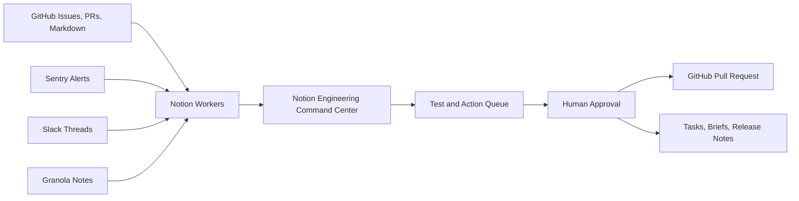

# Shape Machine Architecture

Shape Machine uses Notion Workers to turn engineering activity into a Notion-native command center for a small startup.

## Product Boundary

The user is a product builder, engineering manager, or CTO who needs to answer five questions every morning:

1. Did production break while I was away?
2. What is engineering actually working on?
3. Which PRs, issues, or tasks are stalled?
4. Did meetings create follow-through?
5. Did shipped work update docs, releases, and stakeholders?

## System Model

## Worker Capabilities

### Managed Syncs

- `githubActivitySync`: repository event memory.
- `githubIssuesBackfill`: full GitHub issue and PR refresh.
- `githubIssuesDelta`: frequent issue and PR updates.
- `sentryIssuesSync`: unresolved production issue refresh.
- `granolaNotesBackfill`: meeting-note backfill.
- `granolaNotesDelta`: meeting-note updates.
- `slackMessagesBackfill`: configured Slack conversation backfill.
- `slackMessagesDelta`: new Slack message capture.

### Tools

- `checkNotionConnection`: validates Notion API access.
- `githubIssuesNotionBackfill`: writes enriched GitHub issue and PR pages into an existing Notion data source.
- `startupDocsGithubToNotion`: imports Markdown docs into a Notion Wiki data source.
- `startupDocsNotionToGithub`: maps a Notion Wiki page back to Markdown and opens a GitHub PR.

### Webhooks

- `githubIssuesWebhook`: reacts to GitHub issue and PR changes.
- `sentryIssueAlertWebhook`: reacts to Sentry issue alerts and writes incident memory.
- `startupDocsGithubPushWebhook`: updates Notion Wiki pages when Markdown changes in GitHub.
- `startupDocsNotionPageWebhook`: opens a GitHub PR when a Notion Wiki page changes.

## Notion Information Architecture

The demo workspace should expose the system as a product:

- `Engineering Command Center`: executive view of current risk and momentum.
- `Signal Inbox`: normalized feed across GitHub, Sentry, Slack, and Granola.
- `Incidents`: production issues with severity, owner, status, source link, and follow-up.
- `GitHub Work`: enriched issues and pull requests.
- `Meeting Action Items`: extracted or reviewed follow-up from Granola notes.
- `Engineering Wiki`: docs synchronized with GitHub Markdown.
- `Daily Briefs`: morning and EOD reports.
- `Test and Action Queue`: prioritized work for humans and coding agents.

## Triage Framework

Every signal is classified into one of five outcomes:

- `Monitor`: useful context, no immediate action.
- `Review`: needs a human decision.
- `Fix`: suitable for a coding-agent task or PR.
- `Document`: stale or missing knowledge should update the Wiki.
- `Communicate`: draft release notes, customer follow-up, or Slack status.

Risky outputs require approval:

- Customer-facing messages.
- Public Slack/status posts.
- Production code changes.
- Docs that are source-controlled.
- Expensive or irreversible operations.

## Test and Action Queue Schema

Recommended Notion database properties:

- `Test`: title.
- `Priority`: select, `P0`, `P1`, `P2`, `P3`.
- `Signal`: select, `Sentry`, `GitHub`, `Slack`, `Granola`, `Wiki`, `Brief`.
- `Action Type`: select, `Monitor`, `Review`, `Fix`, `Document`, `Communicate`.
- `Owner`: people or text.
- `Status`: select, `New`, `Ready`, `In Progress`, `Needs Approval`, `Done`, `Blocked`.
- `Source URL`: URL.
- `Agent Candidate`: checkbox.
- `Approval Required`: checkbox.
- `Acceptance Criteria`: rich text.
- `Demo Notes`: rich text.

## Demo-Safe Data Rule

Use real workflow shapes and real open-source repository activity when possible, but redact private tokens, customer names, sensitive incidents, and private Slack content. If staged rows are needed, label them as sample data and use realistic source links or local preview output.
